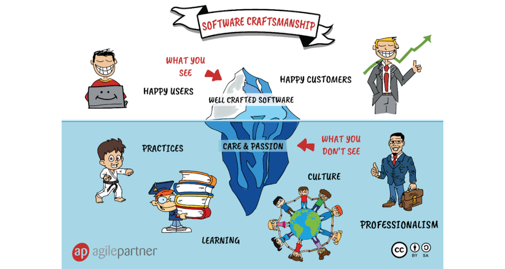

<!-- _class: lead -->

# La Rochelle Software Craftsmenship : Coding Dojo

## 

---

## ~$ whoami

**Sébastien NEDJAR**

Geek et Maker depuis ma naissance

Enseignant Chercheur à Aix-Marseille Université pendant 15 ans

Chercheur Entrepreuneur pendant 4 ans

Arrivé au CESI depuis septembre 2022

---

## Qu’est ce qu’un coding dojo ?

Un coding dojo est un espace de pratique volontaire du code pour les développeurs.

Une citation de Laurent Bossavit exprime bien l’idée :

    Si je veux apprendre le Judo, je vais m’inscrire au dojo du coin et y passer une heure par semaine pendant deux ans, au bout de quoi j’aurai peut-être envie de pratiquer plus assidûment.

    Si je veux apprendre la programmation objet, mon employeur va me trouver une formation de trois jours à Java dans le catalogue 2004.
    Cherchez l’erreur !

    Laurent Bossavit

---

## La Rochelle Software Craftsmenship ?

Une communauté ouverte de développeur pratiquant le software craftsmanship et souhaitant progresser tant individuellement que collectivement.

---

## Software Craftsmenship ?

---

## Que va-t-on faire aujourd'hui ?

Pratiquer un premier simple kata en mob programming (programmation en groupe) pendant 1h. Une seule règle, tout le monde contribue.

Questionner notre pratique quotidienne par une retrospective de 15 minutes en fin de session.

Envisager les dojos suivants avec des échanges informels.
